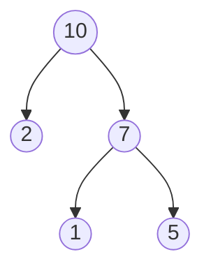

# 堆 Heap
堆 heap，堆就是用数组实现的二叉树，，所以它没有使用父指针或者子指针。堆根据”堆属性“来排序，”堆属性“决定了树中节点的位置。

堆的常用方法：
* 构建优先队列
* 支持堆排序
* 快速找出一个集合中的最小值（或者最大值）

## 堆属性
堆分为两种：最大堆和最小堆，两者的区别在于节点的排序方式。

在最大堆中，父节点的值比每一个子节点的值都要大。在最小堆中，父节点的值比每一个子节点的值都要小。这就是所谓的”堆属性“，并且这个属性对堆中的每个节点都成立。

这个堆的数组表示：[10,2,7,1,5]

根据堆的属性，最大堆总是将其中的最大值存放在树的根节点，而对于最小堆，根节点中的元素总是树中的最小值。堆属性非常有用，因为堆常常被当做优先队列使用，因为可以快速访问到”最重要“的元素。

## heappop()操作

* 调用 heappop(heap) 会将 heap[0]值作为heappop()函数的返回值返回
* 然后 heappop()会把heap[0]的值从heap中删除，并重新调整heap中元素的顺序。
